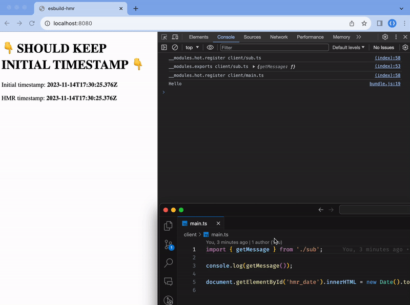

# esbuild-hmr

PoC of Hot Module Replacement(HMR) on [esbuild](https://esbuild.github.io).  
(For [@react-native-esbuild](https://github.com/leegeunhyeok/react-native-esbuild))

- Custom Fils System Watcher
- Transform code to follow custom module system
  - Transform import & export statements
  - [swc-plugin-global-esm](https://github.com/leegeunhyeok/swc-plugin-global-esm)


## Preview

> [!NOTE]
> See `HMR timestamp` in page and console logs carefully.



## Start

```bash
yarn start
```

and visit [http://localhost:8080](http://localhost:8080).

## Overview

```ts
// sub.ts
var __hmr0 = window.__modules.hot.register('client/sub.ts');

export const getMessage = () => 'Hello';
global.__modules.export('client/sub.ts', {
  "getMessage": getMessage,
});

__hmr0.accept(...);
__hmr0.dispose(...);
```

```ts
// main.ts
var __hmr1 = window.__modules.hot.register('client/main.ts');
var getMessage = global.__module.import('client/sub.ts').getMessage; // `import { getMessage } from './sub';`

console.log(getMessage());

document.getElementById('hmr_date').innerHTML = new Date().toISOString();

__hmr1.accept(...);
__hmr1.dispose(...);
```

when file changes detected, transform target file and send it to client via web socket.

```ts
// On hmr message (client-side web socket message handler)
disposeCallbacks.forEach((callback) => callback());
try {
  eval(payload.body);
  acceptCallbacks.forEach((callback) => callback({ body: payload.body }));
} catch {
  // When some error occurs, fallback to fully reload.
  window.location.reload();
}
```

- Register and get modules to global context with `window.__modules.import`, `window.__modules.export`.
- `window.__modules.hot.register('...')` is create HMR context.
  - Can be store accept or dispose callbacks for side-effects.
